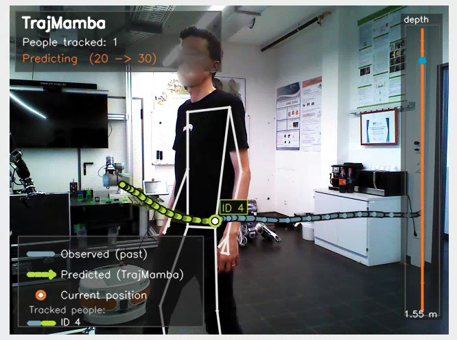

# NIT-TrajMamba — Real-Time Human Trajectory Prediction from RGB-D

> **Real-Time Human Trajectory Prediction from RGB-D for Mobile Robots Using Bi-Mamba**
> Basheer Al-Tawil, Magnus Jung, Ayoub Al-Hamadi
> *International Conference on Control, Mechatronics and Automation (ICCMA), 2026*

A ROS 2 package for multi-person 3D trajectory estimation and short-horizon
future-trajectory prediction. It detects the hip centre with MediaPipe Pose,
deprojects it to 3D using depth, and predicts the next 3 seconds of motion with
**TrajMamba** — a lightweight bidirectional Mamba (selective state space) model
with a GRU decoder.

The model has **~262K parameters** and runs in real time on-board an NVIDIA
Jetson Orin.



---


## Requirements

- **ROS 2** Humble or Jazzy
- **Python** 3.10+
- Synchronised **RGB + depth + CameraInfo** topics (RealSense, TIAGo head
  camera, or any equivalent)
- Python packages not covered by `rosdep` — see [`requirements.txt`](requirements.txt):
  `torch`, `mediapipe`, `requests`

### Model files

A trained TrajMamba checkpoint (`best_model.pth`) and a MediaPipe
`pose_landmarker.task` file are required. Both are **downloaded automatically on
first run** from `checkpoints_url` if not already present locally — see
[`checkpoints/README.md`](checkpoints/README.md). If the download fails, the node
falls back to whatever is already on disk.

---

## Installation

```bash
# 1. Clone into your ROS 2 workspace
mkdir -p ~/ros2_ws/src && cd ~/ros2_ws/src
git clone https://github.com/basheeraltawil/NIT-TrajMamba.git

# 2. Install dependencies
cd ~/ros2_ws
rosdep install --from-paths src --ignore-src -r -y
pip install -r src/nit_human_traj_estimation/requirements.txt

# 3. Build
colcon build --packages-select nit_human_traj_estimation
source install/setup.bash
```

---

## Quick start

```bash
ros2 launch nit_human_traj_estimation human_traj_estimation_launch.py
```

The node starts **idle** by default. Activate processing with:

```bash
ros2 service call /nit_human_traj_estimation/activate std_srvs/srv/SetBool "{data: true}"
```

Check status at any time:

```bash
ros2 service call /nit_human_traj_estimation/status std_srvs/srv/Trigger "{}"
```

To start processing immediately instead, set `activation: true` in
[`config/config.yaml`](config/config.yaml).

### Viewing the output

With `enable_window: true` (the default), a live OpenCV window shows the
skeletons, the observed trail, the predicted trajectory with its uncertainty
cone, a depth gauge, and an FPS/status HUD.

| Key | Action |
|-----|--------|
| `q` | Quit |
| `s` | Save screenshot |
| `h` | Toggle HUD |
| `k` | Toggle skeleton overlay |

For headless robot deployment set `enable_window: false`. Output topics are
published either way:

| Topic | Type | Contents |
|-------|------|----------|
| `nit_human_traj_estimation/image` | `sensor_msgs/Image` | Annotated visualisation |
| `nit_human_traj_estimation/markers` | `visualization_msgs/MarkerArray` | Predicted trajectories as line strips (RViz) |
| `nit_human_traj_estimation/predicted_trajectories` | `geometry_msgs/PoseArray` | Predicted trajectories as poses |

---

## GPU on Jetson

> Skip this section if you are running on a desktop GPU or CPU.

A generic `pip install torch` resolves to a build compiled against a newer CUDA
version than the Jetson driver stack supports, and **silently falls back to
CPU**. Use NVIDIA's Jetson-specific `torch` wheel matching your JetPack/L4T
version — check with `cat /etc/nv_tegra_release`.

If you install that wheel into a conda environment, two things matter:

**1. Export `PYTHONPATH`** so the conda environment can also see ROS's system
packages (`catkin_pkg` and friends). Without this, `rqt`-family tools and some
ROS introspection break inside the environment:

```bash
conda activate trajectory
export PYTHONPATH=$CONDA_PREFIX/lib/python3.10/site-packages:$PYTHONPATH:/usr/lib/python3/dist-packages
```

**2. Build with the same environment active that you will launch from.** The
built executable's shebang is pinned to whichever `python3` was active at
`colcon build` time, and does *not* change when you `conda activate` something
else afterwards:

```bash
conda activate trajectory
cd ~/ros2_ws
rm -rf build/nit_human_traj_estimation install/nit_human_traj_estimation log
colcon build --packages-select nit_human_traj_estimation
source install/setup.bash
ros2 launch nit_human_traj_estimation human_traj_estimation_launch.py
```

Confirm with `Device: cuda` (not `cpu`) in the node's startup log.

---

## Configuration

All parameters live in [`config/config.yaml`](config/config.yaml) and are loaded
by the launch file. Edit that file for a deployment, or point at a different one:

```bash
ros2 launch nit_human_traj_estimation human_traj_estimation_launch.py \
  config_file:=/path/to/other.yaml
```

<details>
<summary><b>Full parameter reference</b> (click to expand)</summary>

### Model and input

| Parameter | Type | Default | Description |
|-----------|------|---------|-------------|
| `checkpoint_path` | string | `checkpoints/best_model.pth` | TrajMamba checkpoint (relative paths resolve against the install share dir) |
| `pose_landmarker_task` | string | `checkpoints/pose_landmarker.task` | MediaPipe Pose Landmarker task file |
| `checkpoints_url` | string | *(OVGU cloud share)* | Folder share used to auto-download missing model files |
| `rgb_topic` | string | `/head_front_camera/rgb/image_raw` | Input RGB topic (`Image` or `.../compressed`) |
| `depth_topic` | string | `/head_front_camera/depth/image_raw` | Input depth topic |
| `camera_info_topic` | string | `/head_front_camera/rgb/camera_info` | Camera info — required before any frame is processed |
| `frame_id` | string | `head_front_camera_rgb_frame` | Frame ID for published messages |

### Output

| Parameter | Type | Default | Description |
|-----------|------|---------|-------------|
| `output_image_topic` | string | `nit_human_traj_estimation/image` | Annotated visualisation image |
| `marker_topic` | string | `nit_human_traj_estimation/markers` | Predicted trajectories as `MarkerArray` |
| `pose_array_topic` | string | `nit_human_traj_estimation/predicted_trajectories` | Predicted trajectories as `PoseArray` |

### Activation

| Parameter | Type | Default | Description |
|-----------|------|---------|-------------|
| `activation` | bool | `false` | Whether the node processes frames at startup |
| `activation_service_name` | string | `/nit_human_traj_estimation/activate` | `SetBool` service to activate/deactivate |
| `status_service_name` | string | `/nit_human_traj_estimation/status` | `Trigger` service reporting active/inactive |

### Visualisation

| Parameter | Type | Default | Description |
|-----------|------|---------|-------------|
| `enable_window` | bool | `true` | Show the local OpenCV window (`false` for headless) |
| `window_name` | string | `TrajMamba ROS Live` | Window title |
| `show_hud` | bool | `true` | Show the FPS/status HUD overlay |
| `show_skeleton` | bool | `true` | Draw the MediaPipe pose skeleton |
| `screenshot_dir` | string | `figures` | Destination for `s`-key screenshots |

### Synchronisation and tracking

| Parameter | Type | Default | Description |
|-----------|------|---------|-------------|
| `queue_size` | int | `10` | RGB/depth `ApproximateTimeSynchronizer` queue size |
| `sync_slop` | double | `0.08` | RGB/depth synchronisation tolerance (seconds) |
| `max_people` | int | `4` | Maximum simultaneously tracked people |
| `max_match_dist` | double | `0.8` | Max 3D distance (m) to associate a detection with an existing track |
| `max_misses` | int | `15` | Frames a track survives without a match before being dropped |

</details>

### Prediction behaviour

Each tracked person needs `obs_len` observed frames (taken from the checkpoint's
config, typically 20 at 10 Hz — about 2 seconds) before TrajMamba begins
predicting. Until then they are drawn as an observed-only trail.

Multi-person tracking uses a nearest-neighbour associator
(`max_match_dist` / `max_misses`). **Prediction is independent per person** —
TrajMamba runs once per tracked person, per frame. Social interaction between
people is not modelled; this is the main known limitation and the focus of
ongoing work.

---

## Training and evaluation

The [`training/`](training/) directory contains the TrajMamba training pipeline.
It is **not** part of the installed ROS package — it requires `matplotlib` and a
full `torch` install, and has nothing to do with the ROS runtime.

```bash
cd training

# Train
python3 train_mamba.py \
  --dataset_roots /path/to/rgbd_bonn_dataset \
  --checkpoint_dir ./checkpoints

# Evaluate
python3 evaluate.py \
  --checkpoint ./checkpoints/best_model.pth \
  --dataset_roots /path/to/rgbd_bonn_dataset \
  --plot
```

> **Note:** `training/mamba_model.py` is intentionally a separate copy from the
> runtime `nit_human_traj_estimation/mamba_model.py`. The training pipeline stays
> a standalone, non-ROS tool, while the deployed node bundles its own copy so it
> does not depend on anything outside the installed package. **Keep both in sync
> if you change the architecture.**

---

## Continuous integration

| Workflow | Purpose |
|----------|---------|
| [`build.yaml`](.github/workflows/build.yaml) | `colcon` build on ROS 2 Humble, every push |
| [`jazzy-ci.yaml`](.github/workflows/jazzy-ci.yaml) | Same, against ROS 2 Jazzy |
| [`test.yaml`](.github/workflows/test.yaml) | `ament` lint and style checks (non-blocking) |

---

## Citation

If you use this work, please cite:

```bibtex
@inproceedings{altawil2026trajmamba,
  title     = {Real-Time Human Trajectory Prediction from {RGB-D} for Mobile
               Robots Using Bi-Mamba},
  author    = {Al-Tawil, Basheer and Jung, Magnus and Al-Hamadi, Ayoub},
  booktitle = {International Conference on Control, Mechatronics and Automation
               (ICCMA)},
  year      = {2026}
}
```

---

## Acknowledgment

This research was supported in part by the Federal Ministry of Research,
Technology and Space of Germany (BMFTR) through the project Edison (grant
no. 13N17576); in part by the European Regional Development Fund (ERDF) through
the project ENABLING (grant no. ZS/2023/12/182056); and in part by the ERDF
through the project ORAKEL (grant no. ZS/2023/12/182322), funded by the European
Union and the state of Saxony-Anhalt.

## Contact

Basheer Al-Tawil — [basheer.al-tawil@ovgu.de](mailto:basheer.al-tawil@ovgu.de)
Neuro-Information Technology Group, Otto von Guericke University Magdeburg


