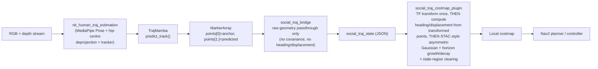

# Human Trajectory Estimation → Predictive Social Costmap for Nav2

Design note for wiring `nit_human_traj_estimation`'s TrajMamba future-trajectory
predictions into a Nav2 local-costmap layer, so the planner reacts to *where a
person is walking toward*, not only where they are standing right now.

This package lives in `socially-aware-navigation/human_traj_nav/` --
alongside, not instead of, that repository's existing simulation-proven
social costmap plugins. `stac_costmap_plugin` and
`nav2_predictive_social_risk_layer` are the direct precedents this design
builds on (studied in full before writing a line of this pipeline's C++);
§2 says exactly what was taken from each and why.

## 1. The gap (one line)

`socially-aware-navigation` already has two layers that reason about a
person's *state*: `stac_costmap_plugin::STACLayer` shapes a bubble around
their *current* position and heading, and `nav2_predictive_social_risk_layer`
rolls a *simulated* constant-velocity guess forward in time. Neither
consumes a real, learned, multi-step trajectory predictor -- both are fed by
`people_msgs/People` (position + velocity only), sourced from Gazebo ground
truth in this workspace's demos. `nit_human_traj_estimation` already runs
TrajMamba (a real Mamba SSM trained on human motion) against a real camera +
depth stream and produces exactly the multi-step future polyline the other
two layers can only approximate -- it just had no navigation consumer.

## 2. What this design takes from each precedent, and why

**From `stac_costmap_plugin::STACLayer`** (studied first, per instruction --
see that package's own README and `src/stac_layer.cpp`):

- The asymmetric-Gaussian cost model itself: `front_covar`/`rear_covar`/
  `side_covar`/`still_covar`, front-lobe stretched by a speed proxy, decided
  per-cell via `angles::shortest_angular_distance` between heading and the
  vector to the cell. `social_traj_costmap_plugin::pointVariances()` /
  `bestCurrentCost()` / `gaussian()` / `get_radius()` are line-for-line the
  same formulation, applied per *predicted point* instead of at one current
  position.
- **Stale-region clearing.** This is the one correctness fix that mattered
  most. A `Layer` (not `CostmapLayer`) subclass writes straight into the
  shared `master_grid`, and only ever *raises* cost via `max()` -- nothing
  else in the plugin chain revisits a cell once painted. STAC's own git
  history shows this bug and its fix (`last_regions_`, a clear pass at the
  top of `updateCosts()` that erases any of last cycle's region no longer
  justified by *this* cycle's data). `nav2_predictive_social_risk_layer`'s
  README explicitly flags that it has **not yet** received the same fix
  ("Known limitations"). `social_traj_layer.cpp` has it from the start
  (`last_regions_`/`bounded_regions_`, one bounding box per track) --
  otherwise every frame's predicted polyline (which moves every cycle, more
  aggressively than a person's single current position) would leave a much
  worse trail of stale cost than STAC's original bug ever did.
- Direct `master_grid.getCharMap()`/`getIndex()` buffer access in both the
  clear and paint passes, matching STAC's style (`nav2_predictive_social_risk_layer`
  uses the `getCost()`/`setCost()` accessors instead -- both are valid Nav2
  patterns; this package follows STAC's since it's the one being mirrored).

**From `nav2_predictive_social_risk_layer`** (studied second -- the closer
conceptual match, since it already does "predict forward, cost the future
position with a growing-uncertainty Gaussian, `max()` over everyone and
every timestep"):

- The core idea that a predicted point needs a *time/horizon-dependent*
  spread, layered on top of STAC's static covariances -- STAC has no
  horizon at all, since it only ever looks at one instant.
  `uncertainty_growth_` (widens every variance with prediction step) is this
  layer's version of that package's `radius(t) = base_radius +
  uncertainty_growth * t`, adapted to grow with *step index* rather than
  *elapsed seconds* (see §3, "why steps and not seconds").
- The exact reach/cutoff derivation documented in that package's README:
  `updateBounds()` must size its dirty window from where the Gaussian
  actually crosses `cutoff`, not the raw variance directly -- inverting the
  Gaussian (`get_radius()`, identical to STAC's own helper) rather than an
  arbitrary multiple of the variance. An earlier draft of this plugin used a
  fixed `3 * sigma` heuristic; this version uses the same principled
  derivation both siblings use.
- `stale_timeout` naming and semantics (a stopped upstream feed gets ignored
  after this many seconds, wall-clock, not sim time).

**Not taken from either:** `people_msgs/People` as the wire format. Neither
message has a field for a multi-step predicted polyline; JSON on
`std_msgs/String` (`social_traj_state`, mirroring `rema_net/social_zone_bridge`'s
own choice for the same reason) is a deliberate, documented divergence --
see `social_traj_bridge`'s own README.

## 3. Pipeline

**Why steps, not seconds** (the one place this design could not directly
copy `nav2_predictive_social_risk_layer`'s time-based growth):
`nit_human_traj_estimation`'s `predict_track()` returns velocity increments
per *model step*, and nothing in the published `MarkerArray` currently
carries that step's real-world duration (it's an implicit property of
whatever frame rate TrajMamba was trained on). Growing uncertainty by
`step_index` and using each point's own displacement (distance from the
previous point) as the front-stretch's speed proxy are both honestly-scoped
to what the message actually contains -- no assumed frame rate, unlike
`nav2_predictive_social_risk_layer`'s explicit `prediction_step` seconds
value (a real, configured quantity there, since it drives its *own* forward
simulation rather than reading someone else's).

**Why `points[0]` (the marker's anchor) is never painted:** it's the
person's last *observed* position (`human_traj_estimation.py`:
`pred_positions = [obs_positions[-1]] + ...`), not a prediction. Costing a
person's current position is `STACLayer`'s job, already running in this same
local costmap (see the example config's comment on why the two layers
coexist without double-counting).

## 4. Two real-robot correctness bugs, found only once actually deployed

Both surfaced during first deployment on `tiago-96c`, after a colleague
walked in front of the moving robot and it reacted to their predicted path
while they were still far away -- prompting a check of whether the
pipeline was actually using correct geometry, not just whether it was
running at all.

**Bug 1 -- `frame_id` default was never a real TF frame on this robot.**
`config.yaml`'s `frame_id` defaulted to `head_front_camera_rgb_frame`.
RViz reported that frame doesn't exist at all; the real one, confirmed
live from the RGB image's own header
(`ros2 topic echo /head_front_camera/rgb/image_raw --once`), is
`head_front_camera_color_optical_frame`. Since a missing TF frame fails
`transformToGlobalFrame()`'s lookup *silently* (a rate-limited `WARN`, not
a crash -- `updateBounds()` just skips painting that cycle), this could
have meant `social_traj_layer` was never painting anything from real
predicted geometry at all, and the avoidance behavior that prompted this
check was actually `stac_costmap_plugin`/`obstacle_laser_layer` reacting
to current position, not this layer reacting to a future one. Fixed in
`config.yaml`; see that file's own comment for why it must be the
*optical* frame specifically, not just *a* frame that happens to exist.

**Bug 2 -- heading/displacement were computed in the wrong frame,
independent of bug 1.** Even with the frame name fixed, an earlier version
of `social_traj_bridge` computed `heading = atan2(dy, dx)` and
`displacement = hypot(dx, dy)` from consecutive *raw* points, in whatever
frame `nit_human_traj_estimation` publishes in -- a camera *optical* frame
(Z-forward, X-right, Y-down), confirmed by bug 1's own finding. An optical
frame's X-Y plane is not the ground plane, so "which way is this person
walking" computed from its X,Y components is not a ground-plane heading at
all. `social_traj_layer.cpp`'s TF step then tried to correct this by
rotating the precomputed heading by the transform's yaw component alone
(`tf2::getYaw(transform.transform.rotation)`) -- which is only correct if
the source-to-global rotation is a pure yaw rotation. An optical-to-odom
transform is a *compound* rotation (remapping Z-forward/X-right/Y-down
into X-forward/Y-left/Z-up), not a pure yaw one, so that correction was
wrong regardless of the frame-name bug.

Fixed by moving heading/displacement computation entirely into
`social_traj_layer.cpp::transformToGlobalFrame()`, computed *after* the TF
transform, from consecutive already-transformed (global-frame) points --
where "which way in the XY plane" is finally a ground-plane-meaningful
question. `social_traj_bridge` now forwards pure geometry: raw point
positions + a `step_index` (`-1` for the anchor, `0..` for predictions),
nothing else. The anchor (`step_index < 0`) is still forwarded -- it's the
necessary reference point for the first predicted point's heading/
displacement -- but is explicitly skipped in every bounds/cost-painting
loop, so it's still never itself costed.

**Lesson for future changes to this pipeline:** any geometric quantity
derived from more than one raw coordinate (heading, displacement, or
anything angular) must be computed *after* whatever frame transform is
going to happen, not before -- rotating a precomputed scalar by "the
transform's yaw" is only ever correct for planar (yaw-only) transforms,
and a camera frame should be assumed to be a full 3D rotation away from
the costmap's global frame until proven otherwise.

**Bug 3 -- checkpoint loaded with 6/92 tensors randomly initialized, not
trained (confirmed fixed).** Every shipped checkpoint (`best_model.pth`,
`best_model0/2/3.pth`, `latest_model.pth` -- checked all five directly with
`torch.load`) stores its Mamba layers in the *fast* (`mamba-ssm` CUDA
kernel) parameter layout, but this deployment was running the *slow*
pure-PyTorch fallback (`mamba-ssm` not installed). `model_utils.py`'s
`remap_fast_to_slow_keys()` only renames keys between the two layouts; it
cannot reshape them, and the two implementations' `in_proj` genuinely have
different shapes ((256,128) vs (256,64)). Result:
`encoder.{0,1,2}.{fwd,bwd}.in_proj.weight` -- all three encoder layers'
most fundamental input projection, both directions -- were running on
random weights, not the trained ones, this whole time.

Fixed by installing `mamba-ssm`/`causal-conv1d` (matching CUDA toolkit to
the installed torch build exactly -- `CUDA_HOME=/usr/local/cuda-12.6` for
this machine's `torch==*+cu126`; a bare `nvcc` on `PATH` resolved to a much
older, incompatible system-default CUDA 11.5 toolkit). Getting `import
mamba_ssm` to actually succeed took several more rounds than expected,
each a legitimate missing pure-Python dependency of code paths this
deployment never uses: `einops`, then (via `mamba_ssm/__init__.py`'s
eager, unconditional import of the full `mamba2`/`mamba3`/`mixer_seq_simple`
submodules) `huggingface_hub` → `httpx` → `idna`, and finally
`transformers` (for an unused `MambaLMHeadModel` HuggingFace-style causal-LM
wrapper) → `sklearn` → `scipy`. Rather than keep installing an
ever-deepening, unrelated dependency chain just to satisfy code this
package never calls, the last import (`MambaLMHeadModel`, needed only for
full-blown text generation, nothing to do with using `Mamba` as a plain
SSM layer) was wrapped in a `try/except ImportError` directly in the
installed `mamba_ssm/__init__.py` -- a deliberate, narrow edit to a
third-party package inside this one conda env, not a change carried in
this repo. Confirmed working end to end: `Model uses fast (mamba-ssm)
kernels; checkpoint stored in fast layout.` /
`Loaded 116/116 tensors into the model.` -- zero mismatches, for the first
time in this deployment's history.

**Real-time performance, confirmed clean.** `controller_server` and
`local_costmap` (where `social_traj_layer` runs) are the same process as
`nav2_mppi_controller`, at `controller_frequency: 50Hz` -- a real
20ms-per-cycle budget shared with our own plugin's `updateCosts()`. An
initial attempt to measure this via `/mobile_base_controller/cmd_vel` while
manually joystick-driving the robot showed alarming multi-second stalls
that got worse over time -- a false alarm: `/mobile_base_controller/cmd_vel`
during manual teleop reflects `twist_mux`/joystick publish behavior, not
MPPI's own control loop, since `computeVelocityCommands()` (and therefore
`updateCosts()`) is only invoked while `controller_server` is actively
executing a `FollowPath` action. Repeated correctly -- autonomous
navigation via RViz "2D Goal Pose", same goal for both conditions --
`social_traj_layer.enabled true` vs `false` showed no measurable
difference: both held ~50Hz with max intervals of 24-28ms (barely above
the 20ms nominal) and near-identical ~2ms jitter. Repeated again with a
person actually walking and continuously tracked (non-trivial, moving
`tracks` every cycle, not an empty list) for the entire measurement window:
same ~50Hz, same 28ms interval ceiling, jitter only marginally higher
(~2.4-3.1ms vs ~1.9-2.3ms) -- confirmed real-time-safe under genuine
tracking load, not just the trivial empty-camera case. The plugin has no
measurable real-time cost. Lesson: when measuring a Nav2 controller's
timing, confirm autonomous navigation is actually driving the topic being
measured before trusting the numbers -- manual teleop and autonomous
control can share an output topic while exercising completely different
code paths upstream of it.

## 5. Not yet done (the actual remaining gap)

1. **A three-way A/B against `stac_costmap_plugin` alone**, the same
   discipline `tiago_social_metrics_monitor` already applies to this
   repo's other layers -- does costing the *predicted* path measurably
   change `d_min`/replans/stop time versus current-position-only STAC, for
   a real (not constant-velocity) mover? Unmeasured either way so far.
2. **Tuning `uncertainty_growth`/`decay_rate`/`displacement_scale` against
   real TrajMamba prediction error**, not just the qualitative shape --
   `training/evaluate.py` already computes prediction error metrics
   offline; correlating per-step error against a good `uncertainty_growth`
   is unexplored, same open item this design doc's first draft flagged. Now
   that predictions run on the fully-loaded, correctly-trained model (Bug
   3 above), this tuning finally reflects real model behavior rather than
   partially-random weights.
3. **Running alongside `stac_costmap_plugin` in the same `local_costmap`
   for real**, not just argued for in §3 -- confirm the two layers' combined
   cost (both `max()`-combined into the same `master_grid`, per Nav2's
   standard layer composition) behaves as intended rather than one
   layer's clear pass ever fighting the other's paint pass on a shared cell.
